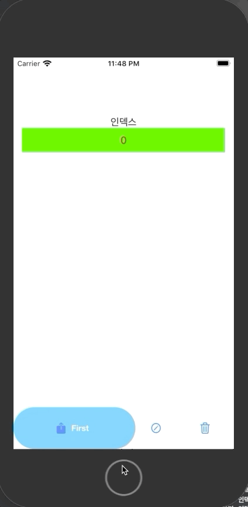
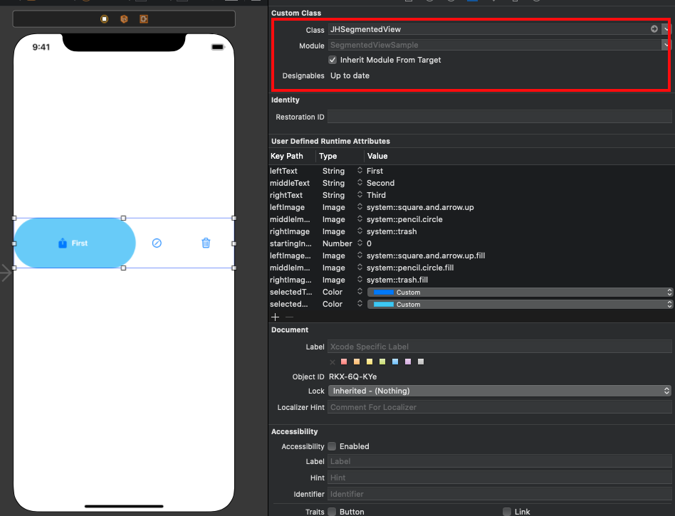

# JHSegmentedView

Custom Segment Cotroll




## Usage

```Swift

class ViewController: UIViewController, JHSegmentedViewDelegate {
    @IBOutlet weak var JHSeg: JHSegmentedView!

    override func viewDidLoad() {
        super.viewDidLoad()
        
        JHSeg.delegate = self
        ...
    }

    func didTapIndex(index: Int) {
        // index is Segment index
        // [TODO] YOUR CODE
    }

}

```

\
## Story Board Custom Class Setting

